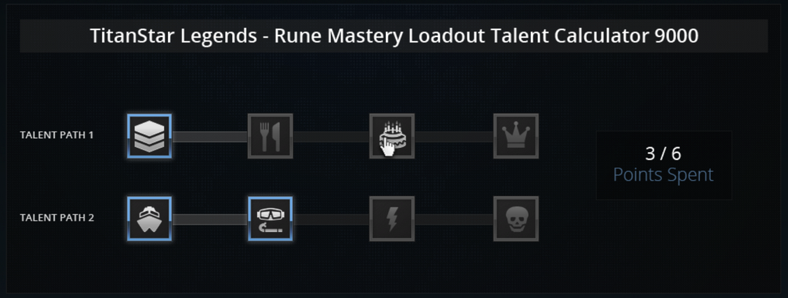

# Front-End Developer Challenge

## Prompt
In this repo you will find a mock-up and all the necessary assets (in a separate folder). The design is of a tool for a fictitious game called “TitanStar Legends”, and will not be repurposed or otherwise utilized by D&D Beyond – it is only a coding challenge.


Below are specific requirements we have which cannot be adequately expressed through the mock-up. This is not a timed assignment, but it should probably take a couple of hours. We ask that you have your assessment completed and returned within 7 days of receiving it. Good luck!

If you feel that you have a personal project that closely resembles this project, send us the repo and we’ll evaluate that project instead. Only your contributions will be evaluated and the project must demonstrate the following competencies with:
- Making an app mobile-friendly/responsive
- Using SCSS
- Creating a stateful JS application

### Assessment expectations

Code reviewers will be directed to pay special attention to the following:

- Styles of submission match the provided mock
- All functionality defined above is present in the submission
- Code organization and maintainability
- If a JS framework is used, are that libraries best practices followed
- Any novel, or additional features beyond the given scope
- You may not use any existing SCSS (SASS), LESS, or CSS frameworks.
  - You may use a style reset, or normalize if you wish.
- You must use SCSS (SASS) to demonstrate competency with the language.

### Rune Mastery Loadout Talent Calculator 9000
Players of TitanStar Legends can spend talent points that they’ve collected on runes within a tree. We need to write a js application that simulates the rune tree within the game so players can replicate their in-game loadouts to share with the TitanStar Legends community.



- Left click to add points.
- Right click to remove points.
- The user may only use up to 6 points.
- Each item only accounts for one point.
- Displays current point total
- The user must select the items in order.
    - For example: The user may not put a point in the cake without first having put points in the chevrons and the silverware (in that order).

## Component Structure
The feature was implemented in React using the Create React App as a base.  
Relevant component files have are located in the `/src/pages/TalentTree` directory.
The top layer component accepts a configuration object in the following format:

```
const talents = {
  maxPoints: 6,
  paths: [
    {
      title: "Talent Path 1",
      talents: [
        { key: TalentsEnum.Chevron, points: 1 },
        { key: TalentsEnum.Silverware, points: 1 },
        { key: TalentsEnum.Cake, points: 1 },
        { key: TalentsEnum.Crown, points: 1 }
      ]
    },
    {
      title: "Talent Path 2",
      talents: [
        { key: TalentsEnum.Boat, points: 1 },
        { key: TalentsEnum.Scuba, points: 1 },
        { key: TalentsEnum.Lightning, points: 1 },
        { key: TalentsEnum.Skull, points: 1 }
      ]
    }],
  activeTalents: [
    TalentsEnum.Chevron,
    TalentsEnum.Boat,
    TalentsEnum.Scuba]
};
```

All business logic is handled within a [Container](src/pages/TalentTree/components/_component) component.
This component converts the configuration model into its own data structure and uses React Hooks to maintain state.

## Use of SASS
I have limited experience with SASS, so I limited my use of it to the following:
- Consolidated all colors a single [colors](src/styles/colors.scss) file
- Standardized breakpoints using [mixins](src/styles/resond.scss)
- Used SASS Maps to generate [classes](src/pages/TalentTree/components/TalentTile.scss) that correlate to the sprites.png file
